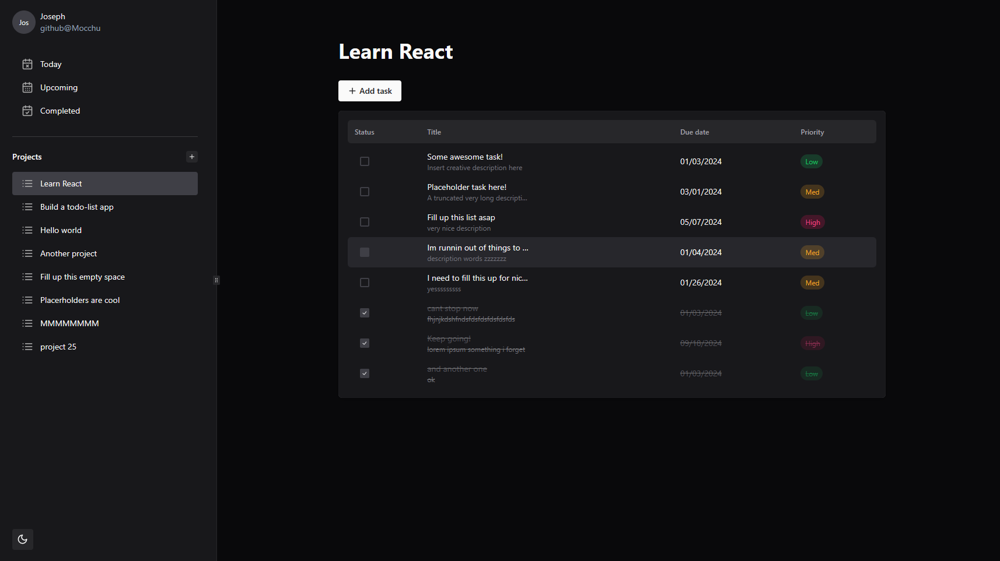

<!-- INTRO -->
<div align="center">
  <a href="https://github.com/othneildrew/Best-README-Template">
    
  </a>

  <h3 align="center">mochi-todo</h3>

  <p align="center">
    An interactive modern task management dashboard
    <br />
    <a href="https://todo-mochi.netlify.app/"><strong>View the demo »</strong></a>
  </p>
</div>

<!-- ABOUT-->

## About The Project

I initially started this project to learn more about modular javascript in vanilla JS. However, shortly into the project it became apparent that developing a project of this scale would be incredibly cumbersome without the use of an external frontend framework.

Logically, I then restarted the project using React purely due to it's popularity. This was my first exposure to a frontend framework and i've learned alot.



### Features

At the moment, I have no plans to integrate authentication or a database of any sort.

- [x] Creating, editing and deleting tasks and projects
- [x] Overdue task indicators via date colour
- [x] Resizable sidebar navigation
- [x] Local storage
- [x] Light and dark theme
- [ ] Mobile support
- [ ] Sort by dates
- [ ] Move completed todos to the bottom
- [ ] Make "Today", "Upcoming" and "Completed" buttons functional

### Built With

I selected the following technologies and components primarily based on their ease of use and aesthetics.

- Framework: [React](https://react.dev/)
- Build tool: [Vite](https://vitejs.dev/)
- Styling: [Tailwind](https://tailwindcss.com/)
- Components: [NextUI](https://nextui.org/)
- Components: [shadcn/ui](https://ui.shadcn.com/)
- Icon pack: [Lucide Icons](https://lucide.dev/)
<p align="right">(<a href="#readme-top">back to top</a>)</p>

<!-- Installation -->

## Usage

### Prerequisites

This is an example of how to list things you need to use the software and how to install them.

- Install npm
  ```sh
  npm install npm@latest -g
  ```

### Installation

_If you want to tinker with the source code here is how you can do so:_

1. Clone the repo
   ```sh
   git clone https://github.com/Mocchu/todo-app-v2.git
   ```
2. Install NPM packages
   ```sh
   npm i
   ```
3. Run the dev server
   ```js
   npm run dev
   ```
   <p align="right">(<a href="#readme-top">back to top</a>)</p>

<!-- LICENSE -->

## License

Distributed under the MIT License. See `LICENSE.txt` for more information.

<p align="right">(<a href="#readme-top">back to top</a>)</p>
